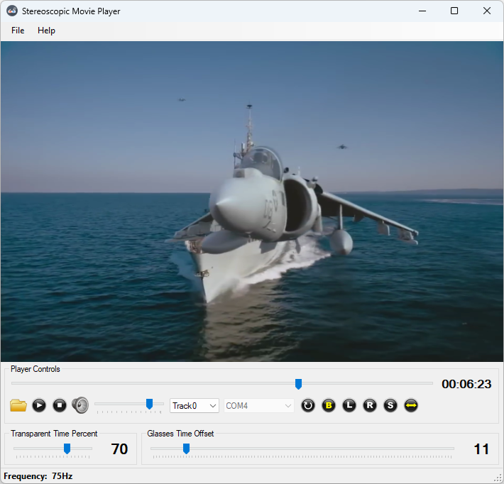
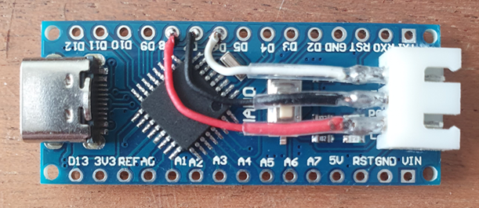
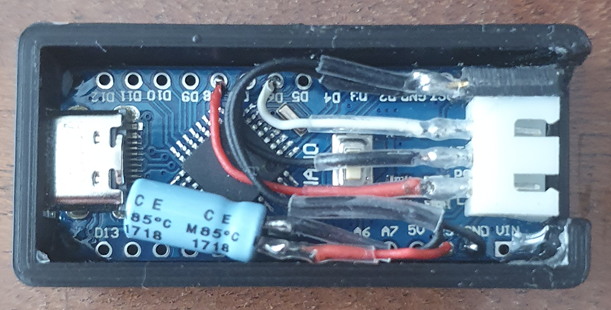

# Stereoscopic Movie Player
SoftCollection Stereoscopic Movie Player allows you to view stereo movies on a regular screen of PC.  
It consists of two projects:  
1. Stereoscopic Movie Player for Windows.  
   You can get video movie with two pictures side by side, one for left eye and one for right eye, and play it using this player.  
   Images for left eye and for right eye are shown alternatively 60 - 144 times a second.  
   After each image is shown, the corresponding information is sent to Arduino Project via Serial COM Port.  
   The information determines which shutter on the Glasses must be opened and which must be closed.  
   When left-eye image is shown, left shutter is opened and right shutter is closed.  
   When right-eye image is shown, right shutter is opened and left shutter is closed.  
   3D Movies you can download for example from YouTube using Youtube Downloader HD or other software.  
   <https://www.youtube.com/watch?v=4L-We9onn9s>  
   <https://www.youtube.com/watch?v=mHDxBvWW9Mg>  
   <https://www.youtube.com/watch?v=QzyjLtzPDNw>  
   <https://www.youtube.com/watch?v=NP9UnI9P87w>  
   <https://www.youtube.com/watch?v=dG4s6WoREpg>  
   <https://www.youtube.com/watch?v=zBa-bCxsZDk>  
   <https://www.youtube.com/watch?v=QzyjLtzPDNw>  
   <https://www.youtube.com/watch?v=VKM1agpjwE0>  
   <https://www.youtube.com/watch?v=ydwPjrKM86A>  

2. 3D Glasses controller Arduino project.  
   This project gets information that was sent from the Windows project above and opens / closes shutters on 3D Glasses.  
   The shutters must be connected directly to Arduino board using cable  

**Remember to copy FFMPEG DLLs from DLLs folder to Debug or / and Release folders of your project!**  
**Please be aware that 3D Glasses may be incompatible with specific Monitor!**

